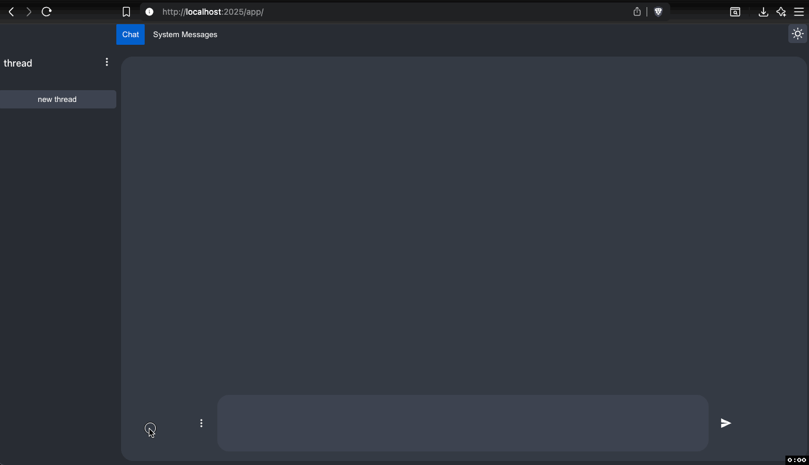

# MyChatGPT

a simple chatgpt web app, built with go and lit

- intended to be simple and easy to use, for local use only
  

### features

1. Select model for chat
2. add system message
3. add prompt
4. indivudaually delete chat messages from the chat, removing from context no next request

### quick start

create .env file

add:

```text
OPEN_AI_SK=your_open_ai_sk
VENICE_AI_SK=your_venice_ai_sk
```

## install go dependencies

```bash
go mod download
```

## install frontend dependencies

```bash
cd frontend
npm install
```

## start in devmode

```bash
make
```

## build

```bash
make build
```

- macos build is in the public folder
- linux build is in the linux folder
